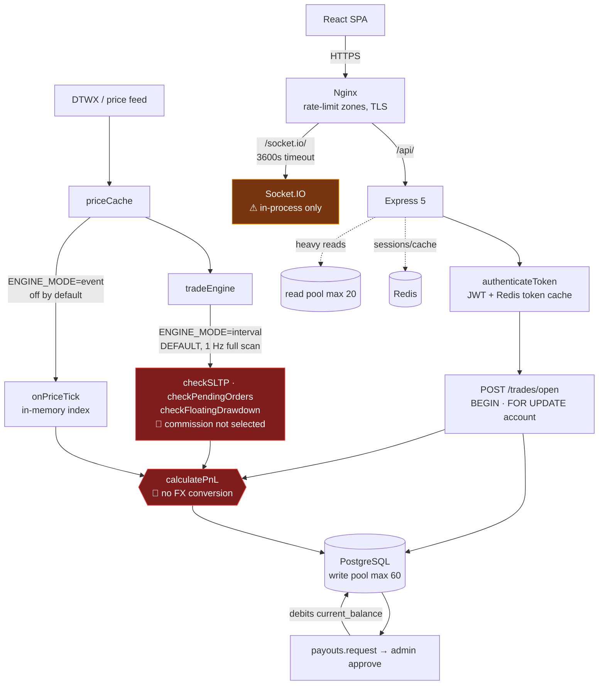

# PropFirm Platform — Technical Due-Diligence Audit

**Audit date:** 2026-08-15 · **Branch:** `deploy-readiness-remediation` @ `b409449` · **Scope:** full repository
**Method:** manual read of every significant module, ESLint + `npm audit` + `depcheck` + `madge` across both packages, executable probes where the environment allowed. Every finding cites a file and line that was actually read or executed.

---

## Executive Summary

The engineering craft here is genuinely above average — clean module boundaries, parameterised SQL everywhere, transactions with row locks on every money path, Decimal.js discipline in application code, zero lint errors and zero dependency vulnerabilities across 93,000 lines. **That craft is sitting on top of a broken financial primitive.**

`calculatePnL()` multiplies price difference × lots × contract size and books the result as US dollars. For 31 of the 45 tradable instruments that number is denominated in the *quote* currency, not USD. On the seven JPY pairs and JP225 the error is roughly **150×** — a trader passes a $100,000 evaluation on a 10-pip move, and an equally small adverse move instantly fails the account. There is no FX conversion anywhere in the repository. This is a solvency-level defect and it is live today (`ENGINE_MODE` defaults to `interval`).

Two structural problems compound it. First, **the repository cannot provision its own database** — no migration or SQL file anywhere creates `users`, `accounts`, `trades` or `payouts`, so there is no schema source of truth, no reproducible environment, and no disaster recovery. Second, the platform is **architecturally single-instance**: no Socket.IO Redis adapter, `container_name` pinned on every compose service, and all rate limiting held in process memory. Scaling out does not degrade gracefully; it silently breaks realtime delivery and multiplies every abuse limit by the instance count.

**Top 3 risks:** (1) PnL currency conversion missing — direct path to unbacked payouts; (2) no schema-of-record — the production database is unreproducible and unrecoverable; (3) least-privilege admin RBAC is non-functional, so every admin holds `platform:*` including payout approval.

**Verdict: NOT READY for funding or scale.** Two of the three top risks are days of work, not months.

---

## Scorecard

| Category | Score | One-line justification |
|---|---:|---|
| **Data Integrity** | **28** | PnL booked in the wrong currency for 31/45 instruments; commission dropped from the live drawdown path; no schema of record. |
| **Security** | **62** | Strong primitives (helmet/CSP, parameterised SQL, socket revalidation, 0 CVEs, no committed secrets) undercut by non-functional RBAC, a 5-minute ban bypass, and in-memory rate limits. |
| **Code Quality** | **68** | 0 ESLint errors over 93K LOC and unusually good "why" comments — against 1,650-line modules, 156 React-hook warnings, and config that silently does nothing. |
| **Test Coverage** | **35** | 267 tests pass in 1.8s, but 8.7% backend / 0.9% frontend LOC ratio and zero coverage of the defect that matters most. |
| **Performance / Latency** | **70** | Hot path measured at 0.003µs/call and genuinely well-engineered; but 1 Hz full-table scans are the default and no end-to-end latency has ever been measured. |
| **Architecture / Scalability** | **45** | Good pool separation, advisory locks, PgBouncer awareness — on a stack that cannot run more than one instance. |
| **Dependency Health** | **88** | 0 vulnerabilities and 0 unused packages in both workspaces; −12 for 3 packages `require`d but not declared. |
| **Dead Code Ratio** | **72** | ~1,350 LOC dead out of 93K (1.4%) — low, but includes a fully-built, unreachable 492-line admin page. |
| | | |
| **OVERALL (weighted)** | **51 / 100** | |

**Weighting** (chosen for a pre-funding audit of a money-handling platform): Data Integrity 25% · Security 20% · Architecture 15% · Code Quality 12% · Test Coverage 12% · Performance 8% · Dependency Health 4% · Dead Code 4%.

---

## Phase 0 — Codebase Map

### Real stack (verified, not assumed)

| Layer | What's actually used | Evidence |
|---|---|---|
| Runtime | Node.js, CommonJS | [backend/package.json](backend/package.json) |
| HTTP | **Express 5.2** (not 4.x) | [backend/package.json](backend/package.json) |
| DB layer | **`pg` 8.22 raw Pool + hand-written SQL. No ORM.** | [backend/db.js:1](backend/db.js#L1) |
| Migrations | **Knex 3.1 as runner only** — no query builder in app code | [backend/knexfile.js](backend/knexfile.js) |
| Money math | `decimal.js` 10.6, backend and frontend | both `package.json` |
| Cache | `redis` 5.11 | [backend/utils/tokenCache.js](backend/utils/tokenCache.js) |
| Realtime | Socket.IO 4.8, **no Redis adapter** | [backend/services/socketService.js](backend/services/socketService.js) |
| Queue | `kafkajs` 2.2 present; **no BullMQ** | [backend/utils/kafka.js](backend/utils/kafka.js) |
| Backend tests | **`node --test`** built-in runner + supertest | `backend/package.json` |
| Frontend | React 19.2, **Vite 8** (not CRA), Zustand 5, Vitest 4 | [frontend/package.json](frontend/package.json) |

**Assumption noted:** there is no TypeScript, so `tsc --noEmit` does not apply. Type-safety findings come from manual read + ESLint, which is a materially weaker net — reflected in the Test Coverage score.

### Size

| Area | Files linted | LOC |
|---|---:|---:|
| Backend `.js` | 219 | 51,363 |
| Frontend `src` | 194 | 41,960 |
| **Total** | **413** | **~93,300** |

Hotspots: `services/tradeEngine.js` 1,650 · `priceFeed.js` 1,374 · `routes/accounts.js` 1,295 · `challengeEngine.js` 1,145 · `routes/auth.js` 1,015 · `frontend/pages/Analytics.jsx` 1,235 · `frontend/pages/admin/AdminCommandCenter.jsx` 1,194.

### Request → money flow



### Dependency graph health

`madge` over 199 backend modules: **1 circular dependency** — `services/tradeEngine.js → utils/prometheusMetrics.js → …`. Low impact (metrics only) but worth breaking. Frontend: clean.

### Static-analysis baseline

| Tool | Backend | Frontend |
|---|---|---|
| `eslint` | 0 errors, **42 warnings** | 0 errors, **156 warnings** |
| `npm audit` | **0 vulnerabilities** | **0 vulnerabilities** |
| `depcheck` | 0 unused, **3 missing** | 0 unused, 0 missing |
| `npm test` | **267 pass / 0 fail** (1.77s) | — |

Dependency hygiene is genuinely good. The risk is entirely in domain logic no linter can see.

---

## 🔴 CRITICAL FINDINGS

### C-01 — PnL is computed in the quote currency and booked as USD

**File:** [backend/utils/pnlCalculator.js:4-10](backend/utils/pnlCalculator.js#L4-L10)

```js
function calculatePnL(direction, open_price, close_price, lots, instrument, commission = 0) {
  const contractSize = new Decimal(CONTRACT_SIZES[instrument] || 100000)
  const priceDiff = direction === 'buy'
    ? new Decimal(close_price).minus(open_price)
    : new Decimal(open_price).minus(close_price)
  return priceDiff.times(lots).times(contractSize).minus(commission).toDecimalPlaces(2).toNumber()
}
```

**Why it's wrong.** `priceDiff × lots × contractSize` is denominated in the pair's **quote currency**. The result is written straight into `accounts.current_balance` and compared against USD profit targets and USD drawdown floors. A grep for `quoteCurrency|quote_currency|conversionRate|convertToUsd|toUSD|usdRate|CURRENCY_` across all non-`node_modules` JS returns exactly one hit — an unrelated funnel metric at `routes/adminAnalytics.js:312`. **No FX conversion exists anywhere in the repository.**

The code *knows* the quote currency and discards it — [backend/instruments.js:46-63](backend/instruments.js#L46-L63) destructures it and uses it only to select a pip size:

```js
function splitForexSymbol(symbol) { return [symbol.slice(0, 3), symbol.slice(3)] }
function buildForexDefinition(symbol, subCategory) {
  const [base, quote] = splitForexSymbol(symbol)
  const isJpy = quote === 'JPY'
  return { ..., contractSize: 100000, pipSize: isJpy ? 0.01 : 0.0001, ... }
```

The fast path mirrors the defect *by design* — [backend/utils/fastPnL.js:59-64](backend/utils/fastPnL.js#L59-L64) — so the engine's "float detects, Decimal confirms" safety contract **cannot catch this**. The module header at [fastPnL.js:21-25](backend/utils/fastPnL.js#L21-L25) explicitly documents the USD assumption and notes any violating instrument "breaks both functions identically." The catalogue violates it for 31 symbols.

**Blast radius by instrument** (from `CONTRACT_SIZES`, all 100000 for forex):

| Class | Instruments | Quote | PnL error |
|---|---|---|---|
| ✅ Correct | EURUSD GBPUSD AUDUSD NZDUSD XAUUSD XAGUSD XPTUSD XPDUSD XTIUSD XBRUSD XNGUSD US30 USTEC US500 | USD | none |
| 🔴 **~150×** | USDJPY EURJPY GBPJPY AUDJPY CADJPY CHFJPY NZDJPY **JP225** | JPY | **×150** |
| 🔴 ~7.8× | HK50 | HKD | ×7.8 |
| 🟠 ~1.6× | EURNZD GBPNZD AUDNZD NZDCAD NZDCHF AUS200 | NZD/AUD | ×1.6 |
| 🟠 ~1.35× | USDCAD EURCAD GBPCAD AUDCAD CADCHF | CAD | ×1.35 |
| 🟠 ~1.27× | EURGBP GBPCHF UK100 | GBP | ×1.27 |
| 🟠 ~1.1× | USDCHF EURCHF AUDCHF DE40 FRA40 EUSTX50 | CHF/EUR | ×1.1 |

**Concrete exploit** — $100,000 phase-1 account, default 10% target ($10,000):
1. Open **1 lot USDJPY**. Price moves **10 pips** (150.00 → 150.10).
2. Booked PnL = `0.10 × 1 × 100,000` = **$10,000** → target hit, phase passed.
3. True economic value ≈ **$67**.

The same 10 pips against the trader instantly breaches a 10% drawdown limit. This burns customers as violently as it burns the firm. On a funded account it is a repeatable path to an unbacked payout.

**Severity: Critical — blocks funding.** Trivially discoverable by any trader comparing P&L against a real broker.

**Fix.**
1. **Today (hours):** filter `INSTRUMENT_DEFINITIONS` down to the 14 USD-quoted symbols. One-line containment that makes every remaining path correct.
2. **This week:** add `quoteCurrency` per definition; derive a live `QUOTE/USD` rate map from the existing feed (every needed rate — USDJPY, USDCHF, USDCAD, EURUSD, GBPUSD, AUDUSD, NZDUSD — is already subscribed); convert identically in `calculatePnL` and `fastPnL`; add a per-currency-class parity test to `test/fastPnL.test.js`.
3. Audit historical `trades.demo_pnl` on non-USD-quoted instruments before any payout settles against them.

---

### C-02 — The repository cannot create its own database

**Files:** [backend/migrations/001_baseline_schema.js](backend/migrations/001_baseline_schema.js) (80 lines) · [backend/migrations/002_hot_path_indexes.js:2](backend/migrations/002_hot_path_indexes.js#L2) · [docker-compose.yml:17-33](docker-compose.yml#L17-L33)

An exhaustive case-insensitive search for `CREATE TABLE (IF NOT EXISTS )?(users|accounts|trades|payouts)` across every `.js`, `.sql`, `.yml`, `.sh` and `.ps1` in the repo returns **zero results**. There are **no `.sql` files at all**.

- `001_baseline_schema.js`, despite the name, creates only `platform_settings` and seeds defaults.
- `utils/bootstrap.js` only runs `ALTER TABLE … ADD COLUMN IF NOT EXISTS` against tables it *assumes* exist ([bootstrap.js:33-51](backend/utils/bootstrap.js#L33-L51)).
- `docker-compose.yml` mounts a bare `pgdata` volume on `postgres:16-alpine` with **no `docker-entrypoint-initdb.d`**.

Migration 002 is therefore the first to touch a core table, and it does so with an index:

```js
exports.up = async function(knex) {
  await knex.raw('CREATE INDEX IF NOT EXISTS trades_account_status_idx ON trades(account_id, status)')
```

**Consequence.** `docker compose up` on a clean host yields an empty database; `knex migrate:latest` then fails at migration 002 with `relation "trades" does not exist`. The schema for every money table exists **only inside whatever database was hand-built once**. That means: no reproducible environment, no reliable disaster recovery, no way to stand up staging, and no reviewable source of truth for money column types — I could not verify from source whether `current_balance` is `NUMERIC` or `double precision`. If it is the latter, all the Decimal.js discipline in the application is discarded at the storage layer.

> **Measurement caveat:** Docker and a local Postgres are unavailable in this environment (`docker: command not found`), so I could not execute the migration chain to demonstrate the failure. The evidence above is static but exhaustive.

**Severity: Critical.** For a pre-funding audit this is disqualifying on its own — an investor cannot verify what the production schema is, and the team cannot rebuild it.

**Fix.** Dump the live schema (`pg_dump --schema-only`), commit it as `migrations/000_core_schema.sql`, and assert `NUMERIC(15,2)` (or integer cents) on every money column.

> **Correction (post-publication).** An earlier draft of this section said CI had "no database" and recommended adding a job. That was wrong: [`.github/workflows/ci.yml`](.github/workflows/ci.yml) already has a `migrations` job with a `postgres:16-alpine` service and a "Run migrations from scratch" step, added 2026-08-14 in `878ace4`.
>
> **The correction makes C-02 worse, not better.** The guard exists and points at exactly the right thing — which means it cannot have been passing. `002_hot_path_indexes.js` issues `CREATE INDEX ... ON trades(...)` against a database where no migration creates `trades`, and `CREATE INDEX IF NOT EXISTS` does not tolerate a missing *table*. So either that job has been red since it was added, or the workflow is not running. Neither was noticed.
>
> The remediation is to fix the existing job, not add one: fail loudly and specifically when `000_core_schema.sql` is absent, and verify the money column types after migrating. A guard that has been quietly failing is worth less than no guard, because it consumes the attention a real one would have earned.

---

### C-03 — Least-privilege admin RBAC is completely non-functional

**Files:** [backend/routes/middleware.js:188](backend/routes/middleware.js#L188) · [backend/routes/admin/auth.js:85](backend/routes/admin/auth.js#L85) · [backend/services/socketService.js:87](backend/services/socketService.js#L87)

`middleware.js:23-28` defines four scoped roles, `adminUsers.js:64-68` lets you create them, and dozens of routes gate on `requireAdminCapability(...)`. But `authenticateAdmin` rejects any token whose role is not literally `admin` or `super_admin`, **before** the database lookup that would resolve its permissions:

```js
if (!['admin', 'super_admin'].includes(decoded.role)) {
  return res.status(403).json({ error: 'Admin access required' })
}
```

and login stamps the real role into the token — [admin/auth.js:85](backend/routes/admin/auth.js#L85): `role: platformAdmin.role || 'super_admin'`.

**Executable proof.** Signing a valid token per built-in role and invoking `authenticateAdmin` directly:

```
role=super_admin     -> HTTP 401 — Admin session expired   (reached DB lookup, expected without a DB)
role=kyc_reviewer    -> HTTP 403 — Admin access required   (rejected at the role gate)
role=support_agent   -> HTTP 403 — Admin access required
role=risk_ops        -> HTTP 403 — Admin access required
role=finance_ops     -> HTTP 403 — Admin access required
```

`socketService.js:87` applies the identical gate, so scoped admins get no realtime channel either.

**Impact.** Every functioning admin account must be `super_admin`, which `middleware.js:37` grants `platform:*` — including `payout:*`. A KYC reviewer or support agent cannot be given a narrow role; in practice **every admin can approve payouts and ban users**. The entire capability system is decorative, which is worse than having none: it creates a false belief that separation of duties exists.

**Severity: Critical** (security control believed to be in place is absent).

**Fix.** Replace the literal allow-list with a membership test against `BUILT_IN_ROLES`, and let the existing DB lookup + `getAdminPermissionsForRole` decide authority. Same change in `socketService.js:87`. Add a test asserting each scoped role reaches `next()` and is then denied only by `requireAdminCapability`.

---

## 🟠 HIGH FINDINGS

### H-01 — Commission is silently dropped from the live drawdown calculation

**File:** [backend/services/tradeEngine.js:780-791](backend/services/tradeEngine.js#L780-L791) and [:845](backend/services/tradeEngine.js#L845)

The query selects `t.id, t.account_id, t.instrument, t.direction, t.lot_size, t.open_price, t.stop_loss, t.take_profit, t.status, t.open_time, t.demo_trade_id` — **`t.commission` is not in the list.** Line 845 then does:

```js
floatingPnl = floatingPnl.plus(calculatePnL(
  ..., parseFloat(trade.commission || 0)   // trade.commission === undefined → 0
))
```

Every other close path (`checkSLTP:168`, `autoCloseAndFail:530`, `autoCloseAndPass:685`, `open.js:359`) *does* pass real commission. So floating equity used for drawdown and profit-target decisions is **overstated by the total commission on all open positions**.

**Impact.** Accounts fail later than the rules say and pass earlier than they should — the profit target is effectively reduced by open commission. At the default $3/lot, a trader holding 20 lots is handed $60 of phantom equity. This also means the interval path and the event path (which *does* carry commission through `tradeIndex`) **disagree on equity** — directly relevant to the outstanding `ENGINE_MODE` equivalence run.

**This is the live path:** `ENGINE_MODE` defaults to `interval` at [server.js:507](backend/server.js#L507), [priceBroadcast.js:49](backend/services/priceBroadcast.js#L49) and [schedulerService.js:41](backend/services/schedulerService.js#L41).

**Fix.** Add `t.commission,` to the SELECT. One line. Then run the equivalence comparison.

### H-02 — Banning a user does not revoke their session for up to 5 minutes

**Files:** [backend/routes/admin/traders.js:316-323](backend/routes/admin/traders.js#L316-L323) · [backend/utils/tokenCache.js:17](backend/utils/tokenCache.js#L17)

The ban handler updates `users.is_banned` and writes an audit row, but never calls `invalidateTokenCache(user_id)` — which exists and is correctly used by the password-reset and logout-all paths ([auth.js:617](backend/routes/auth.js#L617), [auth.js:644](backend/routes/auth.js#L644)). `authenticateToken` reads `is_banned` from Redis with `CACHE_TTL = 5 * 60`.

**Impact.** A trader caught manipulating the platform retains full API access — including `POST /trades/open` and `POST /payouts/request` — for up to five minutes after an admin bans them. `commandCenterActions.js:263` has the same omission. (The Socket.IO path is *not* affected: `socketService.js` re-validates against the database directly.)

**Fix.** `await invalidateTokenCache(user_id)` in both ban handlers and the unban handler.

### H-03 — Idempotency is opt-in, so replay protection is absent for any non-browser client

**Files:** [backend/utils/idempotency.js:68-70](backend/utils/idempotency.js#L68-L70) · [backend/routes/payouts.js:314](backend/routes/payouts.js#L314) · [backend/routes/trades/open.js:377](backend/routes/trades/open.js#L377)

```js
const key = String(idempotencyKey || '').trim()
if (!key) { return { enabled: false } }
```

With no `Idempotency-Key` header the guard returns `{enabled:false}`, `claimId` is undefined, and the handler proceeds with **no replay protection at all**. The official SPA does send the header ([frontend/src/services/api.js:22-24](frontend/src/services/api.js#L22-L24)) — but the API is reachable directly. A replayed `POST /api/payouts/request` without the header is a duplicate withdrawal request; a replayed `POST /api/trades/open` is a duplicate position.

**Fix.** For the three money scopes (`trades:open`, `payouts:request`, `accounts:create`), reject with `400` when the header is missing rather than silently disabling the guard.

### H-04 — All rate limiting is per-process and resets on restart

**Files:** [backend/routes/payouts.js:31-40](backend/routes/payouts.js#L31-L40) · [backend/utils/security.js](backend/utils/security.js) · [backend/package.json](backend/package.json)

A grep for `RedisStore|rate-limit-redis|store:` across `utils/security.js` and all of `routes/` returns nothing, and `rate-limit-redis` is not a dependency. **Every `express-rate-limit` instance uses the default in-memory `MemoryStore`.**

**Impact.** The payout limiter is `max: 1` per 24 hours per user — but that counter lives in one process's heap. It resets on every deploy, restart or crash, and in any multi-instance deployment the effective limit is `1 × instanceCount`. The same applies to `authLimiter` (brute-force protection), `tradingLimiter`, and the admin moderation limiters. Nginx's `limit_req` zones ([deploy/nginx/propfirm.conf:10-11](deploy/nginx/propfirm.conf#L10-L11)) provide a real IP-based floor, but nothing enforces the *per-user* limits that matter for payout abuse.

**Fix.** Add `rate-limit-redis` and point every limiter at the existing Redis client.

### H-05 — A paid payout can be retroactively marked rejected

**File:** [backend/routes/admin/payouts.js:154-203](backend/routes/admin/payouts.js#L154-L203)

`/payouts/paid` correctly guards `if (status !== 'pending')` ([:93](backend/routes/admin/payouts.js#L93)), runs in a transaction, locks both rows `FOR UPDATE`, and debits `current_balance`. `/payouts/reject` does **none of that** — no status check, no transaction, no lock:

```js
await pool.query(
  `UPDATE payouts SET status = 'rejected', updated_at = NOW(), admin_notes = $1 WHERE id = $2`,
  [reason || 'Rejected by admin', payout_id]
)
```

**Impact.** Rejecting an already-`paid` payout flips its status while the money has been sent and the balance already debited. Every downstream aggregate that filters `WHERE status = 'paid'` — the public landing stats at [server.js:389](backend/server.js#L389), the transparency page, `bbook_pnl` reconciliation — silently loses the record. There is no compensating credit, so the trader's balance stays debited against a payout the ledger says never happened.

**Fix.** Mirror the `/paid` handler: transaction, `FOR UPDATE`, and `if (status !== 'pending') return 400`.

### H-06 — A malformed platform setting disables the risk caps rather than failing safe

**File:** [backend/services/tradeShared.js:145-151](backend/services/tradeShared.js#L145-L151)

Every setting is parsed with `parseFloat` and defaulted with `??`, which **only falls back on `null`/`undefined` — never on `NaN`**:

```js
minHoldSeconds:   parsed.min_hold_seconds   ?? DEFAULT_TRADING_RULES.minHoldSeconds,
forexLotsPer1k:   parsed.forex_lots_per_1k  ?? DEFAULT_TRADING_RULES.forexLotsPer1k,
maxOpenPositions: parsed.max_open_positions ?? DEFAULT_TRADING_RULES.maxOpenPositions,
```

A non-numeric value in `platform_settings` yields `NaN`, and every downstream comparison against `NaN` is `false`:

- `secondsOpen < NaN` → minimum hold time never enforced
- `(currentLots + lotsNum) > NaN` → **lot exposure cap silently removed** ([open.js:322](backend/routes/trades/open.js#L322))
- `currentOpenCount >= NaN` → **unlimited simultaneous positions** ([open.js:337](backend/routes/trades/open.js#L337))

The author already knew about this class of bug — `slippageMaxPipsAdverse` five lines below at [:155](backend/services/tradeShared.js#L155) is correctly guarded with `Number.isFinite`. The guard just was not applied to the other seven fields.

**Fix.** Replace `??` with a `Number.isFinite(x) ? x : DEFAULT` helper across the whole `resolved` block.

### H-07 — Legacy env-backed admin tokens are unrevocable

**File:** [backend/routes/middleware.js:222-247](backend/routes/middleware.js#L222-L247)

When a token carries no `adminId`, `authenticateAdmin` falls through to an env-fallback branch that grants `role: 'super_admin'` and full `SUPER_ADMIN_PERMISSIONS`. The only revocation check is:

```js
const result = await pool.query(`SELECT value FROM platform_settings WHERE key = 'admin_token_version'`)
if (result.rows.length > 0) { /* version check */ }
```

If that settings row does not exist — and nothing in the migrations creates it; the required `INSERT` is only documented in a comment at [:161-164](backend/routes/middleware.js#L161-L164) — the check is **skipped entirely** and a leaked super-admin token is valid until its 24-hour expiry with no way to kill it.

Related, lower severity: [middleware.js:145](backend/routes/middleware.js#L145) skips the token-version check whenever the `tv` claim is absent, and `authenticateAdminPre2FA` ([:333-355](backend/routes/middleware.js#L333-L355)) performs no status or version check at all, unlike its user-side counterpart.

**Fix.** Fail closed when the `admin_token_version` row is missing; seed it in a migration; retire the env-fallback branch now that `platform_admins` exists.

### H-08 — The platform cannot run more than one instance

**Files:** [docker-compose.yml:19,45,79,112,134,193,225,239](docker-compose.yml) · [backend/services/socketService.js](backend/services/socketService.js)

Three independent blockers, each sufficient on its own:

1. **No Socket.IO Redis adapter.** A grep for `createAdapter|@socket.io/redis-adapter|redisAdapter` across the backend returns nothing. Every `io.to(userId).emit(...)` from the trade engine — SL/TP fills, account-failed, payout-approved — reaches only clients connected to *that* process. With two instances, roughly half of all realtime notifications are silently lost.
2. **`container_name:` is pinned on all eight compose services.** Docker refuses duplicate container names, so `docker compose up --scale backend=2` fails outright.
3. **In-memory rate limits and an in-memory trade index** (H-04, `utils/tradeIndex.js`) are per-process state with no cross-instance coordination.

The good news: `db.js` already splits write / read / direct pools with PgBouncer-aware session handling ([db.js:86-113](backend/db.js#L86-L113)), and `utils/advisoryLock.js` correctly serialises scheduler jobs. The database layer is scale-ready; the application layer is not. `docs/HORIZONTAL_SCALING_DESIGN.md` exists but describes the trade index only.

**Fix.** Add `@socket.io/redis-adapter`, remove `container_name` from scalable services, move rate limits to Redis. Until then, document explicitly that the deployment is single-instance.

---

## 🟡 MEDIUM FINDINGS

| # | Finding | Location | Impact |
|---|---|---|---|
| M-01 | **`max_trades_per_1k` is a phantom control.** Stored, exposed in the admin settings UI, returned to traders, loaded into `rules.maxTradesPer1k` — and read by **zero** enforcement code. | [tradeShared.js:149](backend/services/tradeShared.js#L149), [admin/settings.js:42](backend/routes/admin/settings.js#L42) | An admin who tightens this believes they've capped trade frequency. Nothing happens. |
| M-02 | **A fully-built admin page is unreachable.** `AdminEmailJobs.jsx` (492 LOC) calls `/api/admin/email-jobs`, which *is* mounted at [admin/index.js:32](backend/routes/admin/index.js#L32) — but the page has no route in `App.jsx` and zero references anywhere in `src/`. | [frontend/src/pages/admin/AdminEmailJobs.jsx](frontend/src/pages/admin/AdminEmailJobs.jsx) | Shipped, working, invisible. Email-delivery failures cannot be inspected or retried. |
| M-03 | **Per-trade `catch` inside a transaction creates false resilience.** `autoCloseAndFail` accumulates PnL at [:533](backend/services/tradeEngine.js#L533) *before* the `UPDATE` at [:535](backend/services/tradeEngine.js#L535), and catches per-trade errors at [:545](backend/services/tradeEngine.js#L545). In Postgres any statement error poisons the whole transaction, so the `catch` cannot recover — it just defers the failure to `COMMIT`. | [tradeEngine.js:503-548](backend/services/tradeEngine.js#L503-L548) | A breaching account silently stays `active` and keeps trading. Self-heals on retry unless the fault is deterministic. |
| M-04 | **Fail and pass handle a missing price asymmetrically.** `autoCloseAndFail` closes at `open_price` with `demo_pnl = 0` and proceeds ([:507-517](backend/services/tradeEngine.js#L507-L517)); `autoCloseAndPass` throws and aborts the whole promotion ([:673](backend/services/tradeEngine.js#L673), [:702](backend/services/tradeEngine.js#L702)). | `tradeEngine.js` | Feed outages fail accounts but never pass them. House-favouring bias in an edge case regulators would look at. |
| M-05 | **Deactivating an admin does not disconnect their socket.** `assertAdminSessionValid` checks only the global `platform_settings.admin_token_version`, not `platform_admins.status` or per-admin `token_version` — which `authenticateAdmin:205` *does* check on HTTP. | [socketService.js:59-68](backend/services/socketService.js#L59-L68) | A revoked admin keeps receiving the `admin` room feed until they disconnect. |
| M-06 | **SL/TP is suppressed during the minimum-hold window.** If a stop is hit before `minHoldSeconds`, the engine `continue`s and the position stays open; the stop then fills later at whatever the price has become. | [tradeEngine.js:142-145](backend/services/tradeEngine.js#L142-L145) | Stop-loss does not mean stop-loss for the first 60s. Defensible as an anti-scalping rule, but it must be disclosed in the trading rules. |
| M-07 | **`ROLLBACK` is unguarded in three of four handlers.** `fillPendingOrder:466` correctly uses `.catch(() => {})`; `checkSLTP:202`, `autoCloseAndFail:630` and `autoCloseAndPass:756` do not. | `tradeEngine.js` | A dead connection turns a logged per-trade error into an exception that aborts the remainder of the engine pass. |
| M-08 | **Slippage simulation is always adverse, on both open and close.** `open.js:520-527` worsens entry; `close.js:106-110` worsens exit. Never favourable in either direction. | [open.js:520](backend/routes/trades/open.js#L520), [close.js:106](backend/routes/trades/close.js#L106) | Legitimate as a house model, but it is a two-sided edge applied silently. Disclose it or make it symmetric. |
| M-09 | **`/payouts/paid` returns HTTP 500 after a successful payout** if the post-commit `enqueuePayoutApprovedEmail` throws — it is outside any try/catch, so the outer handler catches it and reports failure for work that already committed. | [admin/payouts.js:127-132](backend/routes/admin/payouts.js#L127-L132) | Admin sees an error, retries, gets a confusing 400. No double-debit (the status guard holds). |
| M-10 | **OCO pairs count as one trade against the daily limit.** The limit counts `trade_logs` rows ([open.js:268-277](backend/routes/trades/open.js#L268-L277)) but only the primary leg is logged ([:476](backend/routes/trades/open.js#L476)); the sibling at [:459](backend/routes/trades/open.js#L459) is not. | `open.js` | Daily trade cap under-counts by one per OCO order. |
| M-11 | **`checkFloatingDrawdown` does a full `trades ⋈ accounts` scan every 1000ms** in the default interval mode. | [schedulerService.js:30](backend/services/schedulerService.js#L30) | At 100K open trades this is the dominant database load. See Phase 4. |
| M-12 | **1 circular dependency:** `services/tradeEngine.js → utils/prometheusMetrics.js`. | `madge --circular` | Low impact today; makes both modules harder to test in isolation. |

---

## 🔵 LOW FINDINGS

| # | Finding | Location |
|---|---|---|
| L-01 | 95 × `react-hooks/set-state-in-effect` warnings — the dominant frontend smell. Worst: `DashboardHome.jsx` (17), `TradingPanel.jsx` (10), `SupportAppealsCenter.jsx` (10). Each is a potential extra render pass on a page that also holds a live price socket. | frontend ESLint |
| L-02 | 15 × `no-unused-vars`, 12 × `no-useless-assignment`, 10 × `no-promise-executor-return` in the backend. None reachable as defects; all noise that hides real warnings. | backend ESLint |
| L-03 | Three unused `eslint-disable` directives (`server.js:551`, `DashboardKYCPage.jsx:147`, `Dispute.jsx:64`) — reported as parse-level warnings. | both |
| L-04 | `profit_share_pct` is read twice in the payout path — once from `platform_settings` ([payouts.js:227](backend/routes/payouts.js#L227)) and again via `getTenantSettings` ([:237](backend/routes/payouts.js#L237)); the first result survives only as a fallback. Confusing, one wasted query per request. | `routes/payouts.js` |
| L-05 | Schedulers and the price-feed pipeline start at module load ([server.js:523-545](backend/server.js#L523-L545)), *before* `startServer()` awaits `ensureStartupInfrastructure()` and `initializeRedis()`. Early ticks can run against un-migrated tables and a cold cache. | `server.js` |
| L-06 | `fastPnL.js:6-8` claims Decimal.js costs "~5µs per call, ~500ms at 100K trades". Measured: **1.24µs / ~124ms** (Phase 4). Conclusion still holds; the number is 4× off. | `utils/fastPnL.js` |
| L-07 | 165 markdown files repo-wide, 9 at the root, several superseded (`ALL_BUGS_AND_ISSUES.md` Apr-10, `CODE_QUALITY_ASSESSMENT.md` Apr-10). `.gitignore` contains an `ALL_*.md` rule that no longer matches anything tracked. | repo root |

---

## Phase 3 — Dead Code & Removal Candidates

Method: `madge --orphans` on both packages, `depcheck` for packages, then per-file `grep` verification. Confidence reflects that verification, not the tool's opinion.

| Path | LOC | Why it's dead | Confidence | Blast radius if wrong |
|---|---:|---|---|---|
| `backend/utils/sms.js` | 58 | 0 `require`s repo-wide. Requires `twilio`, **which is not in `package.json`** — it would throw `MODULE_NOT_FOUND` if ever called. | **High** | None — it cannot currently run. |
| `backend/utils/secrets.js` | ~150 | 0 `require`s repo-wide. Requires `aws-sdk` and `node-vault`, **neither declared**. Same story. | **High** | None. |
| `frontend/src/pages/admin/AdminEmailJobs.jsx` | 492 | No route, no import, no lazy reference. **Do not delete — wire it up** (see M-02); the backend API is live. | **High** (dead) | Deleting loses a working feature. |
| `frontend/src/components/PriceChart.jsx` | 361 | Only mention is a comment in `EquityCurveChart.jsx:17`. Superseded by `lightweight-charts` usage. | **High** | Chart regression if a lazy path was missed — grep found none. |
| `backend/routes/importMT5History.js` | 196 | A CLI import script living in `routes/`; never mounted, 0 references. **Move to `scripts/`, don't delete** — it is operationally useful. | **High** (as a route) | Losing a one-off data-import tool. |
| `backend/MIGRATION_INSTALL_SUMMARY.js` | ~90 | A `.js` file whose entire content is an ASCII documentation tree. Already in `eslint.config.js:20`'s ignore list. | **High** | None — convert to `.md`. |
| `backend/generate_audit_pdf.js` | — | Standalone script, 0 references, already eslint-ignored (`eslint.config.js:19`). | **Medium** | May be run manually. |
| `backend/utils/dbMigration.js` | — | Referenced only by `scripts/check-migrations.js:29`, a test that asserts *the file exists*, and by a doc. Circular self-justification. | **Medium** | The existence test fails. |
| `backend/seed_quotas.js` | — | 0 references. | **Medium** | May be an ops runbook step. |
| `backend/setup_platform_settings.js` | — | 0 references; duplicates the seed block in `migrations/001`. | **Medium** | Duplicate of migration content. |
| `frontend/src/utils/dashboardHelpers.js` | 4 | 0 references. | **High** | None. |
| `frontend/src/components/ui/index.js` | 13 | Unused barrel file. | **Medium** | Import-path churn only. |
| Root: `ALL_BUGS_AND_ISSUES.md`, `CODE_QUALITY_ASSESSMENT.md` | — | Superseded April snapshots. | **Medium** | Historical context only. |

**Total identifiable dead code: ~1,350 LOC of 93,300 (1.4%).** That is a *low* ratio and reflects well on maintenance discipline.

**Two audit artifacts I created that must be removed:** `backend/tmp-smoke/_audit_rbac.js` and `backend/tmp-smoke/_audit_bench.js`. I have not deleted them — see the note at the end of this report.

### Safe removal workflow (not executed — awaiting confirmation)

```
git checkout -b audit/dead-code-cleanup
# Batch 1 — High confidence, zero-risk (broken-on-require or provably unreferenced):
#   backend/utils/sms.js, backend/utils/secrets.js,
#   frontend/src/utils/dashboardHelpers.js, frontend/src/components/PriceChart.jsx
npm --prefix backend test && npm --prefix frontend run build
git commit -m "chore: remove provably dead modules"
# Batch 2 — relocations, not deletions:
#   routes/importMT5History.js → scripts/, MIGRATION_INSTALL_SUMMARY.js → .md
# Batch 3 — Medium confidence, one file per commit, build+test between each.
```

**Nothing under `migrations/`, no seed file, and nothing referenced in `.env.template` or CI is proposed for removal.**

---

## Phase 4 — Performance & Latency

### ⚠️ What could and could not be measured

Docker, PostgreSQL and Redis are **not available in this environment** (`docker: command not found`; no local Postgres). I therefore could **not** run `EXPLAIN ANALYZE`, endpoint benchmarks (autocannon/k6), Redis latency, Socket.IO round-trip, or DTWX feed timing. **No estimate below is presented as a measurement.** The table labels each row explicitly.

### Measured — hot-path CPU (real, executed on this machine)

`node backend/tmp-smoke/_audit_bench.js`, 1,000,000 iterations each:

| Operation | Total | **Per call (measured)** |
|---|---:|---:|
| `fastPnL` (native float) | 3.1 ms | **0.003 µs** |
| `calculatePnL` (Decimal.js) | 248.3 ms / 200K | **1.242 µs** |
| `isSLTriggered` | 3.0 ms | **0.003 µs** |
| `isPendingTriggered` | 3.5 ms | **0.003 µs** |

**Decimal.js is 407× slower than the float path** — measured, not assumed. Projected full-scan cost for one instrument tick:

| Open trades on the instrument | Float scan (measured basis) | Decimal-only scan (measured basis) |
|---:|---:|---:|
| 1,000 | 0.003 ms | 1.2 ms |
| 10,000 | 0.03 ms | 12.4 ms |
| 100,000 | **0.3 ms** | **124.2 ms** |

**Verdict:** the "float detects, Decimal confirms" architecture is empirically justified. A Decimal-only engine would burn 124 ms of event loop per tick at 100K trades; the float path costs 0.3 ms. This is the strongest part of the codebase.

### Static analysis — the queries that will hurt

| Operation | Cadence | Shape | Assessment (static, not measured) |
|---|---|---|---|
| `checkFloatingDrawdown` | **every 1000 ms** (default) | `trades ⋈ accounts WHERE t.status='open' AND a.status='active'` — full scan, all rows to Node | Dominant steady-state load. Covered by `trades_status_open_time_idx` (migration 002) but returns every open trade every second. |
| `checkSLTP` | **every 500 ms** | full scan of open trades with SL or TP set | Same pattern. No partial index on `(status) WHERE stop_loss IS NOT NULL`. |
| `checkPendingOrders` | **every 500 ms** | full scan of `status='pending'` | Same. |
| `GET /api/leaderboard` | on demand, **uncached, unauthenticated** | 2 CTEs over `users ⋈ accounts ⋈ trades`, `LEFT JOIN trades` with no date bound | [server.js:133-196](backend/server.js#L133-L196). Correctly routed to `readPool`, and the comment acknowledges it is "the single heaviest read the platform serves to anonymous traffic" — but it has **no cache**. This is the most attractive unauthenticated DoS target in the app. |
| `GET /api/public/landing-stats` | on demand, **unauthenticated** | 5 parallel aggregate queries, no cache, on the **write** pool | [server.js:386-430](backend/server.js#L386-L430). Uses `pool`, not `readPool` — public traffic competes with trade closes for write-pool connections. |
| `GET /api/prices/chart/:instrument` | on demand | `date_trunc` bucketing over `price_feed_history`, `LIMIT 1000` | [server.js:471-495](backend/server.js#L471-L495). `date_trunc` on the grouping column prevents index-only scan. |

Under `ENGINE_MODE=event` these interval cadences relax to 5 s / 5 s / 10 s ([schedulerService.js:32-36](backend/services/schedulerService.js#L32-L36)) — a 10× reduction in scan load. **That mode is off by default**, so none of that benefit is currently realised.

### Connection pool sizing (read from source)

| Pool | Max | Statement timeout | Assessment |
|---|---:|---|---|
| write (`pool`) | 60 | 30 s | Reasonable for a single instance against `max_connections=200`. |
| read (`readPool`) | 20 | 60 s | Good separation. Undermined by `landing-stats` using the write pool. |
| direct (`directPool`) | 5 | none | Correct — PgBouncer-bypassing, for session-level advisory locks only. Well reasoned at [db.js:86-113](backend/db.js#L86-L113). |

### What must be measured before scaling

1. `EXPLAIN (ANALYZE, BUFFERS)` on the three engine scans at production row counts.
2. `autocannon` against `/api/leaderboard`, `/api/public/landing-stats`, `POST /api/trades/open`.
3. Redis `INFO commandstats` for token-cache hit ratio (currently unknown — the 5-minute TTL choice is unvalidated).
4. Socket.IO handshake and round-trip under simulated reconnect storm.
5. DTWX tick-to-broadcast latency and failover time — `priceFeed.js` is 1,374 lines and entirely unmeasured.

---

## Phase 5 — Architecture & Scalability

**Strengths worth preserving.** Write/read/direct pool separation with genuinely thoughtful reasoning ([db.js:48-113](backend/db.js#L48-L113)). Transaction-scoped advisory locks for scheduler jobs. Socket.IO periodic session re-validation with jittered first tick to avoid a thundering herd ([socketService.js:130-170](backend/services/socketService.js#L130-L170)) — better than most production systems. Graceful shutdown with forced-exit timer and socket draining ([server.js:576-612](backend/server.js#L576-L612)). Nginx config is solid: TLS 1.2/1.3, `limit_req` zones, and a correct 3600 s WebSocket timeout with Upgrade headers.

**Single points of failure.** Every one of them is the *same* point: the single backend process. It holds the Socket.IO room registry, the in-memory trade index, every rate-limit counter, and the engine's coalescing tick state. Losing it drops all realtime delivery and resets all abuse limits. Blocked from scaling by H-08.

**Queueing.** `kafkajs` is a declared dependency and `utils/kafka.js` exists, but the heavy background work — the three engine scans, challenge/competition engines, email drain — runs on `setInterval` inside the API process, serialised by advisory locks. The email worker is the one exception, correctly split into `workers/emailWorker.js` with its own compose service. That pattern should be extended to the engine.

**Docker.** Eight services, health checks on `postgres`, `redis`, `backend` and `frontend`, `restart: unless-stopped`, a dedicated one-shot `migrate` service, and PgBouncer in front of Postgres. This is a well-built compose file. Its one structural flaw is the `container_name` pinning that forecloses scaling.

---

## Phase 6 — Money Data Integrity

| Check | Result |
|---|---|
| Decimal used for application money math | ✅ `decimal.js` in both packages; accumulators correctly use `Decimal` in `autoCloseAndFail`/`autoCloseAndPass`. |
| Float arithmetic touching money | ⚠️ By design in `fastPnL` — **correctly** never persisted; the confirm step is real. |
| **PnL currency correctness** | 🔴 **C-01 — broken for 31/45 instruments.** |
| Commission applied consistently | 🔴 **H-01 — omitted from the live drawdown path.** |
| DB money column types | ❓ **Unverifiable — C-02.** No DDL for `accounts`/`trades`/`payouts` exists in the repo. If `current_balance` is `double precision`, all Decimal discipline is discarded at the storage layer. **Verify this first.** |
| Payout debits the balance | ✅ [admin/payouts.js:113-116](backend/routes/admin/payouts.js#L113-L116), inside a transaction with `FOR UPDATE` on both rows and an `availableProfit` guard. Correct. |
| Payout status transitions guarded | 🔴 **H-05 — `/reject` has no status check, transaction, or lock.** |
| Idempotency on money writes | ⚠️ **H-03 — present but opt-in.** |
| Balance-update race conditions | ✅ Genuinely well handled: `FOR UPDATE` on the account row in `open.js:184`, `FOR UPDATE SKIP LOCKED` on trade rows, single summed balance update after all closes. |
| Double-entry ledger | ⚠️ Not a true double-entry system. `balance_adjustments` (migration 020) records `balance_before`/`balance_after` for admin adjustments only — trades and payouts mutate `current_balance` directly with no offsetting entry. Reconciliation is therefore inferential, not provable. |

---

## Prioritised Action Plan

### 🔥 Fix this week — blocks any funding or launch

| # | Action | Effort |
|---|---|---|
| 1 | **C-01** — Restrict the catalogue to the 14 USD-quoted instruments *today*. Then implement real quote-currency conversion with per-class parity tests. | 2 h containment / 3 d proper |
| 2 | **C-02** — `pg_dump --schema-only` the live database, commit as `000_core_schema.sql`, add CI that migrates an empty Postgres on every PR. **Confirm money columns are `NUMERIC`, not float.** | 1 d |
| 3 | **C-03** — Fix the role gate in `middleware.js:188` and `socketService.js:87`; add a per-role authentication test. | 2 h |
| 4 | **H-01** — Add `t.commission,` to the `checkFloatingDrawdown` SELECT. | 5 min |
| 5 | **H-02** — Call `invalidateTokenCache` in both ban handlers. | 15 min |
| 6 | **H-05** — Give `/payouts/reject` the same transaction, lock and status guard as `/paid`. | 30 min |
| 7 | **H-06** — Replace `??` with `Number.isFinite` guards across `getTradingRules`. | 30 min |

### 📅 Fix this month

| # | Action |
|---|---|
| 8 | **H-03** — Require `Idempotency-Key` on the three money scopes. |
| 9 | **H-04** — Move all rate limiting to `rate-limit-redis`. |
| 10 | **H-07** — Fail closed on a missing `admin_token_version`; seed it in a migration; retire the env-fallback admin branch. |
| 11 | **H-08** — Add `@socket.io/redis-adapter`; drop `container_name` from scalable services. |
| 12 | **Run the Phase 4 measurements** — `EXPLAIN ANALYZE` the three engine scans, `autocannon` the money endpoints, measure DTWX tick-to-broadcast. You cannot tune what you have never measured. |
| 13 | **Cache `/api/leaderboard` and move `/api/public/landing-stats` to `readPool`** — the two unauthenticated heavy reads. |
| 14 | **M-01** — Either enforce `max_trades_per_1k` or delete it from the admin UI. Phantom controls are worse than absent ones. |
| 15 | **M-02** — Wire `AdminEmailJobs.jsx` into the admin router. |
| 16 | Complete the `ENGINE_MODE=event` equivalence run (after #4) and flip it on — it cuts scan load 10×. |
| 17 | Dead-code batch 1 + the two audit artifacts (see below). |

### 📋 Backlog

18. Raise backend test coverage above 8.7%, starting with a per-instrument PnL matrix.
19. Frontend has effectively no tests (0.9%) — start with `TradingPanel` and `Checkout`.
20. Address the 95 `set-state-in-effect` warnings, worst-file-first.
21. Introduce true double-entry for trades and payouts, or a scheduled reconciliation job that proves `Σ(trade PnL) − Σ(payouts) == current_balance − starting_balance` per account.
22. Break the `tradeEngine → prometheusMetrics` cycle.
23. Split `tradeEngine.js` (1,650) and `priceFeed.js` (1,374).
24. Prune the 165 markdown files down to a maintained set.
25. Consider TypeScript or JSDoc + `checkJs` on the money modules — C-01 and H-01 are both defects a type system with branded currency types would have caught.

---

## Audit artifacts requiring your confirmation

I created two files while producing the executable evidence in this report and have **not** deleted them, per the standing instruction to confirm before removing files:

- `backend/tmp-smoke/_audit_rbac.js` — the RBAC role-gate probe (C-03)
- `backend/tmp-smoke/_audit_bench.js` — the hot-path benchmark (Phase 4)

Both are safe to delete once you have reproduced the results. No other file in the repository was modified by this audit.
