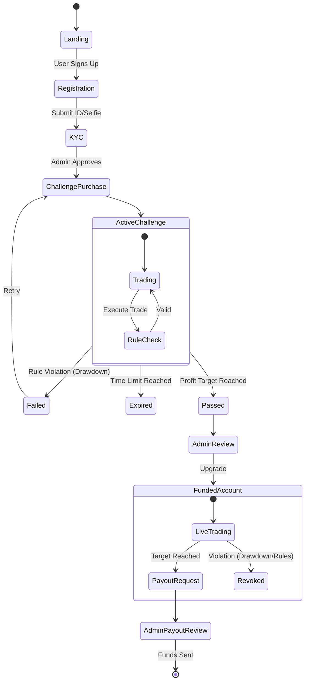
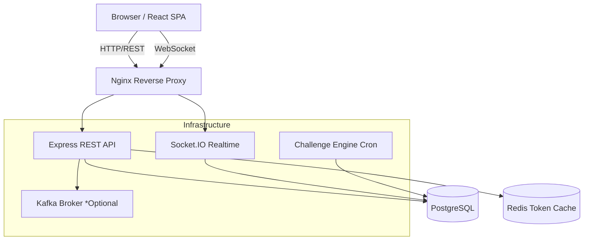
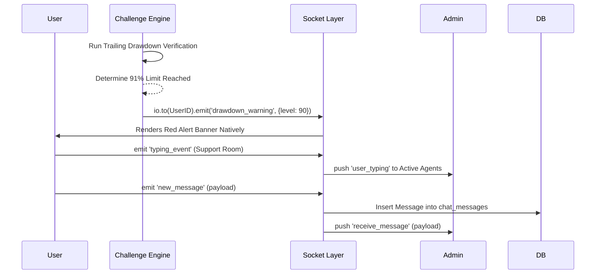

# Prop-Firm Platform: Master System Documentation

This document serves as the master technical and business documentation for the prop-firm platform. It acts as the single source of truth for the system's current architecture, component interactions, deep implementation details, and recommended improvements.

## Table of Contents
1. [Product Overview](#1-product-overview)
2. [End-to-End Workflow](#2-end-to-end-workflow)
3. [System Architecture](#3-system-architecture)
4. [Frontend Architecture (Deep Dive)](#4-frontend-architecture-deep-dive)
5. [Backend Architecture (Deep Dive)](#5-backend-architecture-deep-dive)
6. [Database Overview (Deep Dive)](#6-database-overview-deep-dive)
7. [WebSocket & Realtime Design (Deep Dive)](#7-websocket--realtime-design-deep-dive)
8. [Infrastructure & Deployment](#8-infrastructure--deployment)
9. [Tech Stack Used and Why](#9-tech-stack-used-and-why)
10. [Current Pain Points](#10-current-pain-points)
11. [Runbook & Quick-Start](#11-runbook--quick-start)
12. [Recommended Roadmap](#12-recommended-roadmap)

---

## 1. Product Overview

**What this means:** 
The platform is a proprietary trading ("prop firm") system. It allows everyday traders to sign up, participate in trading challenges (simulated environments), and—if they meet profit targets without violating drawdown rules—earn a "funded account." Funded accounts allow traders to trade company capital and keep a percentage of their profits. Admins oversee the platform, monitoring risk, validating KYC (Know Your Customer) documents, and processing payouts.

**Implementation Details:**
The system is multi-faceted, supporting several user roles (Guest, Trader, Admin) and different account states (Challenge, Funded, Banned, Expired). It manages the entire lifecycle natively, from the landing page to trading execution and payout handling. Rather than fully relying on third-party broker integrations for all logic, it contains internal ledgers and a native "Challenge Engine" to actively enforce trading rules (e.g., max daily loss, opposing trades) in real time.

---

## 2. End-to-End Workflow

**What this means:**
When a trader arrives, they create an account, verify their identity, and purchase a challenge. They open a dashboard with live charts to place trades. The system constantly monitors their balance. If they break a rule (like losing too much in one day), they fail. If they hit their target, an admin reviews their account and upgrades them to a "funded" tier. Once funded, they trade until they request a profit payout, triggering another admin review and payment.

**Implementation Details:**

---

## 3. System Architecture

**What this means:**
The platform is built in two primary pieces: the visual interface (Frontend) that the user sees in their browser, and the brain (Backend) that runs on our servers. They communicate constantly over the internet to ensure prices and account balances are strictly accurate. The system also connects to a database to save all records permanently.

#### High-Level Architecture

---

## 4. Frontend Architecture (Deep Dive)

**What this means:**
The frontend provides a heavily responsive, professional-grade trading terminal layout. It dynamically manages user login states, handles real-time live data binding without page reloads, and isolates administrator functions from the general trading population.

**Deep Implementation Details:**
- **Framework & Topology:** Built on React 19. The overarching router topology is dictated exclusively by `frontend/src/App.js` using `react-router-dom` v7.
- **Component Isolation:** 
  - `Landing`, `Login`, `Register` run outside the protected scope.
  - `Dashboard` integrates `react-grid-layout`, allowing the trader to resize and move sub-windows (trading panels, open positions, history).
  - `AdminLayout` encompasses all administrative views (`AdminUsers`, `AdminTrades`, `AdminPayouts`). It explicitly maintains its own authentication validation flow separate from the trader components.
- **State & Context Layers:**
  - `ThemeContext`: Governs Dark/Light mode tracking, injecting specific CSS variables across the DOM dynamically based on the current user setting.
  - `BrandingContext`: Supplies the platform's logo and base colors from static config (`src/config/branding.js`) for the single firm this deployment serves.
- **Global Network Handlers:** Uses an `Axios` interceptor globally injected in `App.js`. This captures all outbound REST traffic. If the backend returns a `401 Unauthorized` or `403 Forbidden`, the interceptor instantly flushes local user state, redirecting them to the Login boundary. Crucially, it exempts `/api/admin` calls to prevent destroying an administrator's session if a non-critical trader query fails.
- **Data Visualization:** Employs `lightweight-charts` and `Recharts` for high-performance canvas-based candlestick rendering, preventing DOM bloat during rapid tick events.

---

## 5. Backend Architecture (Deep Dive)

**What this means:**
The backend is an uncompromising rules engine. It securely evaluates user authenticity on every single click, executes massive streams of live prices from market Oracles, directly manages trading mathematics, and proactively fails accounts that bypass designated risk limits.

**Deep Implementation Details:**
- **Entrypoint (`server.js`):** A colossal composition bootstrapper. It binds all middleware, establishes the database pool, wires Socket.IO hooks to the server root, initializes Kafka buses (if enabled), and boots the background cron engines like the `newsService.js`.
- **Authentication Flows (`middleware.js`):**
  - Acts as a strict gatekeeper. Validates JWT (JSON Web Tokens). 
  - Security boundaries ensure segregated JWT secrets are used for Admins vs Traders (`process.env.ADMIN_JWT_SECRET` vs `process.env.JWT_SECRET`).
  - Implements **Token Versioning**: Querying the DB (or Redis) on every valid request to verify the token version against the globally allowed `admin_token_version` or a user's local version, ensuring instant session revocation capabilities network-wide.
- **Challenge Engine (`challengeEngine.js`):**
  - **Asynchronous Execution:** Runs on a continuous async loop separate from REST handlers.
  - **Safe Execution Blocks:** Inside `processAccount`, it uses PostgreSQL advisory locks (`FOR UPDATE SKIP LOCKED`) exclusively. This guarantees that if a trader attempts to manually manipulate a trade while the Engine is determining a failure sequence, race conditions are blocked.
  - **Dynamic Math Engine:** Utilizes `Decimal.js` explicitly for `calculatePnL()` ensuring floating point limits do not introduce sub-penny rounding artifacts in global balance ledgers.
  - **Account Lifecycles:** Determines expiry bounds (`expireAccount`), trailing limit breaches (`failAccount`), and progression thresholds (`passAccount`), piping downstream events directly back to the active Socket session so UI updates reflect immediately without the user refreshing.
- **Tenant Routing:** `utils/tenants.js` seamlessly restricts `UPDATE` and `SELECT` query limits universally, appending `tenant_id = ?` guards inherently so data bleeding across firm brands on one database is impossible.

---

## 6. Database Overview (Deep Dive)

**What this means:**
The database is PostgreSQL, acting as the absolute source of truth. Every user interaction, financial balance, internal admin rule update, and live chat message is permanently recorded in these extremely structured tables under strict transactional locking.

**Deep Implementation Details:**
Instead of traditional ORM abstractions, the application writes optimized raw SQL using the `pg` driver to maintain absolute control over query plans and advisory locks.
- **`users` Table:**
  - Structure: `id` (UUID), `email` (CITEXT for case-insensitive unique indexes), `password` (BCRYPT hash), `is_banned` (BOOLEAN), `two_factor_secret`, `trader_uid`.
- **`accounts` Table:**
  - Structure: `user_id` (FK), `current_balance`, `starting_balance`, `peak_balance` (Highest Water Mark recorded for trailing drawdowns), `status` (ENUM: `active`, `passed`, `failed`, `expired`, `locked`).
  - Critical usage: Requires transactional boundaries for any updates to guarantee that overlapping rapid REST executions don't duplicate ledger math.
- **`trades` Table:**
  - Structure: `direction` (buy/sell), `lot_size`, `open_price`, `close_price`, `open_time`, `close_time`, `demo_pnl`, `commission`, `status`.
- **`platform_settings` Table:**
  - Standard Key-Value schema driving all global config behaviors (e.g. `['phase1_profit_target_pct', '10']`, `['min_payout_amount', '50']`).
  - Managed uniquely by a Knex.js migration baseline (`migrations/001_baseline_schema.js`).
- **`chat_messages` / `support_tickets`:** Historical ledgers maintaining immutable conversation boundaries and dispute chains between Traders and Support.

*Note on Schema Ownership:* A known pain point currently is that while `platform_settings` relies on the new `migrations/` folder approach via Knex.js, numerous runtime tables (like `admin_rules`, `bbook_pnl`, `login_logs`) are still dynamically initialized via inline `CREATE TABLE IF NOT EXISTS` clauses sprinkled inside `server.js` and `routes/admin.js`. 

---

## 7. WebSocket & Realtime Design (Deep Dive)

**What this means:**
WebSockets allow the server not just to reply to traders, but to *push* information aggressively to their screens without them asking. This is used to deliver live market price variations every split-second, to push chat responses, and to flash warning banners when an account's risk enters the danger zone.

**Deep Implementation Details:**
- **Market Data Duplexing (`priceFeed.js` -> `Socket.IO`):** 
  - Global emissions using default sockets broadcasting universal `price_update` events encompassing live `.bid` and `.ask` spreads across Forex and Commodity symbols.
- **Challenge Engine Push Behaviors:**
  - `challengeEngine.js` has deep integrations with the active `io` socket tree. It natively calculates drawdown ratios and emits targeted `drawdown_warning` payloads specific to a user's ID connection when they reach 25%, 50%, 75%, and 90% utilization limits of their trailing threshold.
  - Critical state changes, like `account_expired` or `account_failed`, are force-pushed, signaling the React frontend to natively block the trading interfaces instantly.
- **Chat and Support Isolation:**
  - Driven by `chat_conversations` and `chat_messages` DB structures merged against socket events.
  - Clients emit `join_chat_room` sending their authorization token. Once verified by DB permissions, the socket assigns them to an isolated `Socket.IO` room namespace.
  - Subsequent streams like `typing_event` or `new_message` are constrained perfectly to that room, shielding sensitive conversations strictly between the trader and the support admins linked to the active ticket namespace.

---

## 8. Infrastructure & Deployment

**What this means:**
The infrastructure is how the code actually runs on the internet. It leverages a web server (Nginx) to safely route traffic, memory caching (Redis) to speed up security checks, and detailed documentation (Swagger) so developers know how to interact with the system.

**Implementation Details:**
- **Reverse Proxy:** Nginx (`deploy/nginx/propfirm.conf`) proxies `/api/` traffic to Express and maps `$http_upgrade` paths to handle WebSockets correctly.
- **Redis:** (`backend/utils/tokenCache.js`) Stores JWT token versions in memory so the database isn't queried constantly for auth verification.
- **Event Streaming:** Optional integration via `backend/utils/kafka.js` allowing decoupled downstream workers to ingest domain events incrementally.
- **Documentation:** Swagger UI (`backend/routes/swagger.js`) auto-generates interactive API docs mapping endpoint schemas exactly for external API users.
- **Environment & Startup:** Governed heavily by `.env` logic injecting credentials universally at runtime. Server blocks HTTP bindings entirely until Postgres `advisory_locks` and foundational schema setups sequentially finalize upon standard boot.

---

## 9. Tech Stack Used and Why

| Technology | Role | Why It Was Chosen |
|---|---|---|
| **React 19 / React Router 7** | Frontend UI | Massive ecosystem, declarative UI, robust SPA navigation without absolute page refreshes dropping contextual state. |
| **Axios** | Networking | Robust global interceptors (essential for universal uncoupled 401 handling). |
| **Lightweight-Charts / Recharts** | Charting | Handles tens of thousands of data points performantly on canvas for financial tracking without ballooning DOM element trees. |
| **Express 5** | API Backend | Native JS ecosystem sharing context with frontend. Flexible middleware composition model suitable for distinct domain boundaries. |
| **PostgreSQL & Knex** | Database | Strict absolute ACID compliance, robust row-level pessimistic locking (`FOR UPDATE`), and robust mathematical constraints required for a financial ledger tier. |
| **Decimal.js** | Critical Math | Inherent floating-point restrictions make native JS `.1 + .2` equations unsafe for live financial balances. Decimal.js solves this natively. |
| **Socket.IO** | Realtime Comm. | Built-in polling fallback mechanisms natively preventing broken TCP bounds, inherent connection recovery, and elegant room-based subscriptions. |
| **Redis** | Query Caching | Memory bus operations are mandatory for protecting PostgreSQL from excessive JWT `token_version` validation polling overhead under heavy DDOS/trading loops. |
| **Nginx** | Reverse Proxy | Industry standard for strict secure SSL termination, connection limiting, and HTTP/WebSocket namespace demultiplexing. |

---

## 10. Current Pain Points & Improvements Needed

**What this means:**
No software is perfect. Right now, the code works well but is built in a way that makes adding new features harder over time. Some files are much too large, the system lacks full automated testing, and schemas operate in fragmented deployment cycles.

**Implementation Details:**
- **Architecture Debt & Missing Docs:** Extreme logic congestion is isolated within the monolithic `server.js` boundary. Essential Cron initialization, Socket configurations, logging pipelines, and Database boot strategies require modular separation.
- **Inconsistent API Patterns:** Internal Routes mix explicit REST `res.json` blocks alongside arbitrary object returns, limiting API integrability. Requires standardized structural enforcement (JSON:API conventions).
- **Ticket/Chat Duplication:** `disputes.js`, `chat.js`, and `admin.js` functionally implement overlapping independent DB design approaches modeling historical conversations that should be universally merged for UX parity.
- **Limited Testing Boundaries:** Insufficient E2E integration boundaries aggressively shift the burden of release stability monitoring strictly onto Manual QA verifications which limits confident deployments.
- **Mixed Schema Ownership:** `Knex.js` is established yet only covers baseline primitives. Inline SQL DDL `CREATE TABLE` actions deployed inside internal server route components causes substantial tracking opacity requiring alignment.

---

## 11. Runbook / Quick-Start

**Local Startup Order:**
1. Start local **PostgreSQL** server instance.
2. Start **Redis** server (required for high-density token caching parameters).
3. Navigate to `backend/` and execute `npm install`.
4. Ensure `.env` is fully populated referencing active parameters (specifically `PORT`, `DB_URL`, `JWT_SECRET`, `REDIS_URL`).
5. Execute `npm run dev` starting the Express instance (which auto-creates native missing tables).
6. Navigate to `frontend/` and execute `npm install` -> `npm start`.

**Key Access Locations:**
- **API Documentation:** Local access via `http://localhost:<PORT>/api-docs` corresponding to dynamic `swagger.js` definitions rendering API mapping endpoints.
- **Routing Overrides:** Navigate config definitions in `deploy/nginx/propfirm.conf` detailing essential mapping rules connecting React UI domains explicitly toward backend execution proxy routes.

---

## 12. Recommended Roadmap

### Immediate Fixes
- **Backend Recomposition:** Refactor and surgically consolidate the backend `server.js` logic extracting boot startup scripts, `challengeEngine` crons, and complex Socket.IO assignment trees securely into isolated, testable modules.
- **Trading Aggregation:** Migrate distributed calculations managing margin levels, decimal lot constraints, and execution mathematics universally merging them under one highly-tested domain (`TradingEngine`).

### Reliability Improvements
- **Integration Test Grid:** Design extreme robust parameterized E2E tests executing aggressive boundary challenges across the firm's strict lifecycle parameters limiting regression bounds.
- **Standardized Inter-Process API:** Normalize outbound JSON HTTP payload parameters resolving all routes guaranteeing homogenous response models mapping perfectly to standard HTTP semantic errors.

### Scalability Improvements
- **Connection Telemetry Pipeline:** Enable absolute granular PostgreSQL connection array logging maximizing visibility into query exhaustion bounds prior to deployment bottlenecks.
- **Expanded Pub/Sub Adoption:** Complete integration of the `Kafka` baseline bus bridging high-frequency operational events securely toward background workers completely untethered from synchronous REST API overhead loops.

### Documentation/Process Improvements
- **CI/CD Strictness:** Formally establish GitHub action pipelines guaranteeing restrictive code compliance verifications resolving prior lint/test boundary requirements executing blocking controls dynamically.
- **Autogenerated Open-API Mapping:** Prevent isolated documentation models in favor of pure self-generating models matching structural backend payload updates immediately syncing into active system references.

---
*Generated by the Engineering Team.*
