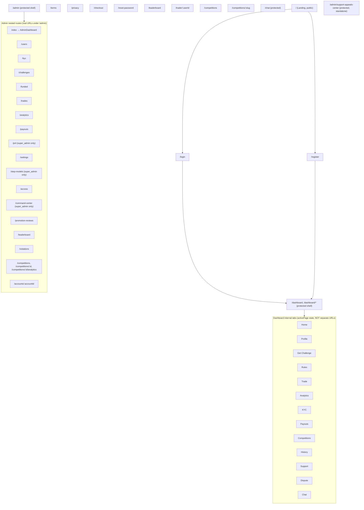
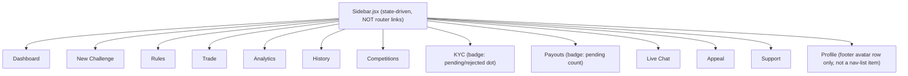
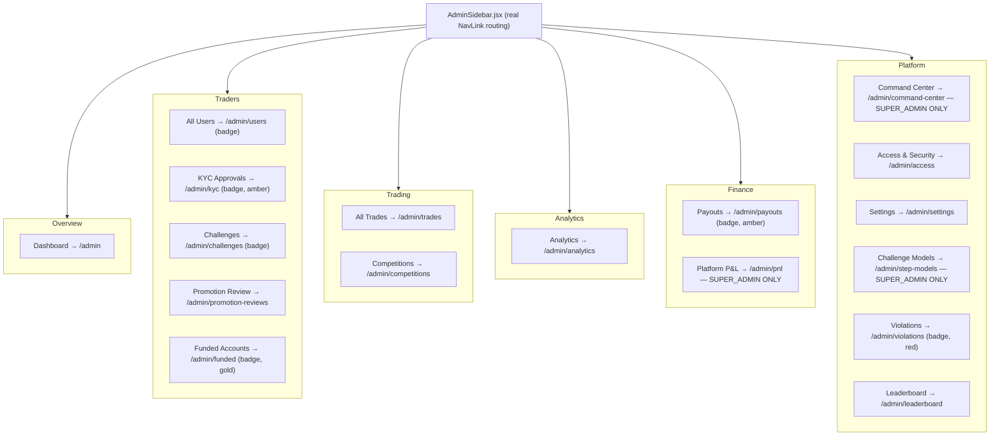
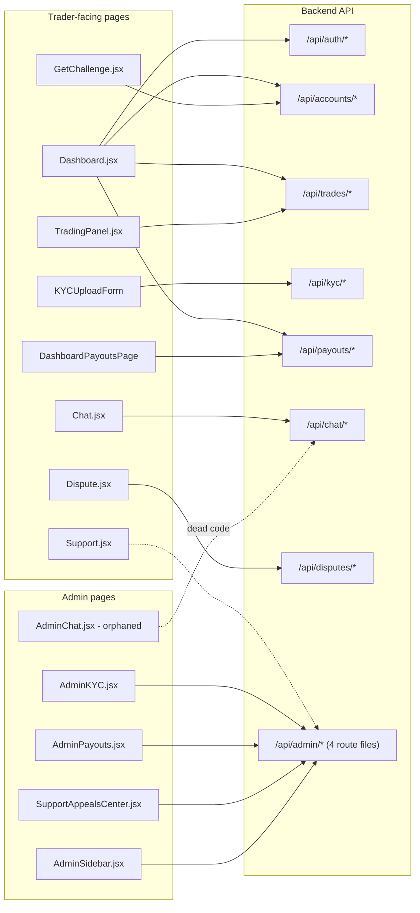

# Frontend Redesign Brief

**Purpose:** This is a complete, as-built reference of the prop-trading-firm web app's frontend — every route, nav item, page, section, component, and its backend connection — written so a design-focused rebuild (pixel-accurate, fully responsive) can be done **without losing any existing functionality, navigation, or data wiring**. It also flags dead code (don't rebuild it) and known visual bugs (fix, don't replicate).

Snapshot date: 2026-07-31. Reflects the single-tenant product after the multi-tenant/copier removal refactor (commit `5366dc4`).

---

## 1. Tech Stack

| Layer | Choice | Notes |
|---|---|---|
| Framework | React 19 + React Router v7 | `BrowserRouter`, `Routes`/`Route`, nested routes only under `/admin` |
| State | Local component state + Zustand | No global Redux-style store; Zustand used sparingly |
| Realtime | Socket.IO client | Trader dashboard, Chat, Admin sidebar badges/alerts all use sockets |
| Animation | Framer Motion | Page transitions (`AnimatePresence`), sidebar collapse, hover/tap micro-interactions |
| Charting | **TradingView "Advanced Real-Time Chart" iframe widget** (`TradingViewWidget.jsx`) is the live chart. `lightweight-charts` and `recharts` are also dependencies but used only for admin analytics charts (`AdminChart.jsx`) and a **dead/unused** `PriceChart.jsx` (see §10) — do not confuse the two charting systems. |
| Styling | Hand-rolled CSS custom properties, **no CSS framework** (no Tailwind, no MUI, no Bootstrap) | A single token system (`tokens.css`) + component classes in `App.css` and `styles/*.css`. Design carefully — Opus 5 should restyle this system, not introduce a framework. |
| HTTP | Axios, httpOnly-cookie auth, `withCredentials: true` | A typed `services/api.js` module exists but is inconsistently adopted — several pages (`Dashboard.jsx`, `Chat.jsx`, `Support.jsx`, `Dispute.jsx`) make raw `axios` calls with a duplicated `API_URL` constant instead |
| Toasts | `react-hot-toast` (trader-facing) and a separate custom `AdminToastProvider` (admin-facing) — two independent toast systems | |
| Forms/uploads | Native forms, `multer`-backed file upload on the backend, `getUserMedia` webcam capture for KYC selfies | |

---

## 2. Design System — "The Ledger Desk"

Source: `frontend/src/styles/tokens.css`. This is a real, intentional design system already in place — the brief for Opus 5 should be "restyle within/evolve this system" rather than "start from a blank slate."

**Concept:** an editorial, financial-print aesthetic — "reads like a printed ledger statement, not a typical fintech app: flat corners, hairline rules, double-border mastheads, serif display type, no shadows, no gradients." Two editions:
- **Light = "Rag Cotton White"**
- **Dark = "Charcoal Noir"**

### Typography
- `--font-display`: Playfair Display (headings/masthead)
- `--font-ui`: Source Serif 4 (body/UI text)
- `--font-mono`: IBM Plex Mono (labels, stat values, numbers)
- Alt pairing available but optional: `--font-display-alt` (Cormorant Garamond), `--font-ui-alt` (Lora)

### Color primitives (note: brand color itself flips between themes, not just lightness)

| Token | Dark ("Night Edition") | Light ("Day Edition") |
|---|---|---|
| `--paper` (bg) | `#131211` | `#F7F4EC` |
| `--paper-2` (surface) | `#1B1917` | `#EFEBDF` |
| `--ink` (text) | `#EDE9E0` | `#1A1A18` |
| `--rule` (border) | `#3A3733` | `#C9C2B0` |
| `--muted` | `#8C8880` | `#6B6862` |
| `--gain` (success/profit) | `#4FBE6E` | `#2E6B3E` |
| `--loss` (danger/loss) | `#E05A5A` | `#8B1E1E` |
| `--warn` (warning) | `#E8B400` | `#A5730A` |
| `--brand-primary` / `--brand-accent` | `#E8B400` (gold) | `#8B1E1E` (deep red) |

Each also has `-strong`, `-rgb`, `-glow` (soft glow shadow color), and `-soft` (tinted background) variants. A "glass" layer (`--glass`, `--glass-2`, `--glass-hi`) provides frosted/translucent surface overlays on top of the flat base.

### Structure tokens
- **Radius: `--radius-sm/md/lg/xl/2xl/pill` are ALL `0`.** Flat corners everywhere is a deliberate design decision, not an oversight — do not round corners in the rebuild unless explicitly asked to break from this system.
- **Shadows: `--shadow-sm/md/lg/surface/operator` are ALL `none`.** Visual hierarchy comes from hairline/double rules, never elevation. (Note: several existing components violate this — see §11 redesign notes.)
- Spacing scale: `--space-1` (4px) through `--space-10` (64px).
- Motion: `--motion-fast` 160ms, `--motion-base` 260ms, `--motion-slow` 420ms, all eased cubic-bezier.
- Layout: `--content-max` 1440px, `--content-wide` 1600px, fluid clamp-based gutters (`--shell-gutter-x/y`).

### Three "mode" overlays
The app scopes tokens differently per section via a body/container class, all pointing back to the same primitives:
- `mode-public` (`styles/modes/public.css`) — marketing/landing pages
- `mode-trader` (`styles/modes/trader.css`) — trader dashboard
- `mode-operator` (`styles/modes/operator.css`) — admin panel, remaps `--admin-*` tokens

### Runtime white-label layer
`BrandingContext.jsx` + `config/branding.js` can override `--brand-primary*`, `--brand-accent*`, `--accent*`, `--admin-accent*` directly on `documentElement.style` at runtime, independent of light/dark — a branding mechanism sits on top of the token system. Preserve this hook if feasible.

### Responsive breakpoints
| Breakpoint | Behavior |
|---|---|
| 1440px | Content max-width caps out |
| 1280px | Trading Terminal's two-column split collapses toward single column |
| 1024px | Trader sidebar switches to off-canvas / mobile bottom-tab-bar; admin sidebar becomes overlay |
| 768px | General layout tightening |
| 640px | Grids collapse to 1 column, mobile-specific padding |

---

## 3. Site Map

Full route table (source: `App.jsx`). Public routes render standalone; `/dashboard` and `/admin` are **shells** that own their own internal navigation.

**Important distinction for the rebuild:** the 13 "Dashboard internal tabs" are **not** React Router routes — they're a single `/dashboard` route whose content switches based on local `activePage` state in `Dashboard.jsx`. The 18 admin sub-pages **are** real routes (`<Route>` children under `/admin`), navigated with `<NavLink>`. Don't accidentally give the dashboard tabs real URLs (or vice versa) unless that's an intentional improvement you flag separately.

`/admin/support-appeals-center` is a standalone route reachable from a button in the admin topbar — it is **not** nested inside the `/admin` layout/sidebar, so it has no admin sidebar visible when open (it has its own 6-tab internal layout, see §5.3).

---

## 4. Navigation Systems

This app has **no single shared Navbar component** — three independent navigation systems exist for three contexts.

### 4.1 Public nav
Used on: Landing, Leaderboard, Competitions, CompetitionDetail, TraderProfile.
Minimal: logo (click → `/`) + `ThemeToggle`. Landing additionally uses a `.nav-transparent` variant that becomes opaque on scroll.

### 4.2 Trader shell (`/dashboard`)

- **Header:** logo mark + "PROP FIRM" wordmark + "Trader Portal" subtitle (hidden text when collapsed).
- **Collapse toggle:** floating circular chevron button, 220px expanded / 64px collapsed, state persisted to `localStorage`.
- **Badges are data-driven, not permission-driven:** KYC item gets a colored dot if status is pending/not_submitted/rejected; Payouts gets a red pill with the pending-payout count; Dashboard item gets a red pill with unread-notification count.
- **Footer:** clickable avatar + name + "• Active" row → navigates to the Profile tab. This is the *only* way to reach Profile on desktop.
- **Mobile (≤1024px):** sidebar is replaced by a bottom tab bar repeating all nav items *plus* an explicit "Profile" tab (since the desktop footer avatar isn't present on mobile).
- **Topbar** (inline in `Dashboard.jsx`, not a separate component): left side shows a live "Terminal Status" indicator (green/red dot + LIVE SYNC/OFFLINE badge, tied to socket connection state); right side shows trader name, a clickable KYC status badge (jumps to KYC tab), a notification bell with unread-count badge and popover (mark-all-read on open, "Clear all" action), `ThemeToggle`, and Logout.

### 4.3 Admin shell (`/admin/*`)

Completely separate auth system from the trader shell (own JWT secret/cookie, own login screen with password + optional TOTP, own socket connection) — see `AdminSessionProvider.jsx`.

- **Role gating:** exactly 3 items are hidden from plain `admin` role and shown only when `session.role === 'super_admin'`: **Platform P&L**, **Command Center**, **Challenge Models**. Every other item is visible to any authenticated admin.
- Badge counts are live — fetched from `GET /api/admin/overview` + `GET /api/admin/violations/summary` on mount and refreshed over Socket.IO events (`admin_violation_updated`, `admin_enforcement_event`, `admin_command_center_updated`, `opposing_trade_detected`, `admin_alert`).
- Footer: avatar + name + role label ("Platform Owner" vs "Administrator") → links to Settings. Collapsible, with a separate mobile overlay (not a bottom tab bar like the trader side).
- **AdminTopBar.jsx:** left = mobile hamburger + breadcrumb ("Admin / <CurrentPage>"); right = role/scope chip ("Platform Owner"/"Administrator" + "Global Scope" + auth-source label), `ThemeToggle`, a Support & Appeals Center shortcut button (→ `/admin/support-appeals-center`), a notification bell (⚠ **currently non-functional placeholder — "Nothing yet." — flag as a bug to fix, not a spec to replicate**), and a profile dropdown (Access & Security / Settings / Logout).

---

## 5. Full Page Inventory

### 5.1 Public pages

| Page | File | Contents |
|---|---|---|
| Landing | `pages/Landing.jsx` | Marketing homepage composed of 9 lazy sub-sections in `pages/landing-sections/`: Hero, LiveStats, Calculator (fee/payout calculator), Features, Scaling (account-scaling plan), Comparison (vs. competitors table), WallOfLove (testimonials), FAQ, Footer. |
| Terms of Service | `pages/TermsOfService.jsx` | Static accordion of legal sections, no API calls. |
| Privacy Policy | `pages/PrivacyPolicy.jsx` | Static accordion, no API calls. |
| Checkout | `pages/Checkout.jsx` | Standalone challenge-purchase landing page — reads a pending selection from an in-memory store, shows plan review (price/targets/drawdown/time-limit/split), "Proceed to Payment" → creates an order → redirects to external payment `checkout_url`. |
| Login | `pages/Login.jsx` | Login form + TOTP 2FA step; also renders (via `ResetPasswordPage` wrapper) in a password-reset mode. |
| Register | `pages/Register.jsx` | Multi-step signup: form → OTP verification → account-creation loading. |
| Leaderboard | `pages/Leaderboard.jsx` | Public top-funded-traders leaderboard; click-through to trader profile. |
| Trader Profile | `pages/TraderProfile.jsx` | Public profile page; exports a chrome-less content component reused inside the dashboard's Competitions tab. |
| Competitions | `pages/Competitions.jsx` | Public competitions list; same chrome-less-reuse pattern. |
| Competition Detail | `pages/CompetitionDetail.jsx` | Single competition + live leaderboard (polls every 15s); same reuse pattern. |

### 5.2 Trader dashboard tabs (all inside `Dashboard.jsx`, switched via `activePage`)

| Tab | Component | Contents / key endpoints |
|---|---|---|
| Dashboard (Home) | `DashboardHome.jsx` | Stats/account overview, countdown widgets, links into Rules/Get-Challenge. |
| Profile | `DashboardProfilePage.jsx` | Profile edit form → `PATCH /api/auth/profile`. |
| Get Challenge | `GetChallenge.jsx` | 3-step wizard: pick step-model → pick account size (KYC-gated, shows live quota/lock state) → confirm modal → `POST /api/accounts/orders`. |
| Rules | `ChallengeRules.jsx` | Rules/progress for the selected account, "Trade Now" → jumps to Trade tab. |
| **Trade** | `TradingPanel.jsx` | See §6 deep-dive. |
| Analytics | `Analytics.jsx` | Equity curve / performance analytics for the selected account. |
| KYC | `DashboardKYCPage.jsx` + `components/dashboard/KYCUploadForm.jsx` | Country/doc-type/doc-number form, ID front/back upload, selfie upload **or live webcam capture modal** → `POST /api/kyc/upload` (multipart). States: not_submitted → pending → approved/rejected (shows rejection reason). |
| Payouts | `DashboardPayoutsPage.jsx` | Available-profit/profit-share stat cards, request-payout form (amount, live preview, payment method, details) → `POST /api/payouts/request`, paginated payout history, "Download Statement" (`GET /api/payouts/statement`). |
| Competitions | `DashboardCompetitionsPage.jsx` | Embeds the chrome-less Competitions/CompetitionDetail/TraderProfile content components. |
| History | inline in `Dashboard.jsx` (no separate file) | Account history list, paginated. |
| Support | `Support.jsx` | Ticket system (distinct from live Chat): submit ticket (category/subject/message) + "My Tickets" list + per-ticket reply thread. |
| Dispute | `Dispute.jsx` | Appeal/dispute submission with reason codes → `POST /api/disputes/submit`; history via `GET /api/disputes/my-disputes`. |
| Chat | `Chat.jsx` | Real-time support chat (same component also mounted at standalone route `/chat`) — conversations list + message thread, Socket.IO powered. |

Overlay (not a tab): **Onboarding** (`Onboarding.jsx`) — 7-step first-login walkthrough, see §7.

### 5.3 Admin pages

| Page | File | Contents |
|---|---|---|
| Admin Dashboard | `pages/admin/AdminDashboard.jsx` | Thin composition of `useAdminDashboardData` hook + shared section components: 6 KPI stat tiles, signup/challenge trend chart, account-status pie, pass-rate funnel bar, hedge-exposure bar, "needs attention" alert tiles (pending KYC/payouts/flagged/banned), live exposure table. |
| All Users | `AdminUsers.jsx` | User management table — filter/search/export, KYC status, ban state, risk tier, per-user drawer. |
| KYC Approvals | `AdminKYC.jsx` | Approval queue — saved views, SLA + quality-flag widgets, document viewer, tag assignment, approve/reject. |
| Challenges | `AdminChallenges.jsx` | Phase 1/2 accounts table, phase/status filters, stat cards. |
| Funded Accounts | `AdminFunded.jsx` | Funded accounts table — balance, payouts, profit split, risk tags. |
| All Trades | `AdminTrades.jsx` | Platform-wide trade ledger — direction/status filters. |
| Analytics | `AdminAnalytics/index.jsx` | 8-tab suite: Trader Performance, Risk & Violations, Firm Profitability, Funnel & Conversion, Trade Behavior, Real-Time Monitoring, Model Optimization, Compliance & Audit. |
| Payouts | `AdminPayouts.jsx` | Payout queue — saved views, approve/reject, tag assignment. |
| Platform P&L *(super_admin)* | `AdminPlatformPnL.jsx` | Platform-wide P&L stat cards/table by month. |
| Settings | `AdminSettings.jsx` | Global platform settings, grouped sections, key/value editor. |
| Challenge Models *(super_admin)* | `AdminStepModels.jsx` | Step-model editor — targets/drawdown/time-limits per phase, per-size pricing. |
| Access & Security | `AdminAccess.jsx` | Admin accounts, 2FA status, security-flag cards. |
| Command Center *(super_admin)* | `AdminCommandCenter.jsx` | Multi-tab ops queue: Account Recovery, Trader Control, Money & Risk. |
| Promotion Review | `AdminPromotionReviews.jsx` | Monthly phase-promotion approval queue. |
| Leaderboard | `AdminLeaderboard.jsx` | Admin view of public leaderboard, visibility toggle per trader. |
| Violations | `AdminViolations.jsx` | Rule-violation monitor, severity/status filters, auto-refresh every 15s. |
| Competitions | `AdminCompetitions.jsx`, `AdminCompetitionDetail.jsx`, `AdminCompetitionAnalytics.jsx` | List + create form (with `PrizePoolEditor`), per-competition settings/edit, per-competition trader analytics table. |
| Account Detail | `AdminAccountDetail.jsx` | Deep-dive into a single trading account (violations/trades/history). |
| **Support & Appeals Center** (standalone, not in sidebar) | `SupportAppealsCenter.jsx` | 6 internal tabs: Support Tickets, Live Chat, Breach Appeals Queue, Notification Center (broadcast composer), Compliance Log, ToS & Agreement Tracking. |

**Shared admin building blocks** (reused across nearly every admin page — rebuild these once as a library, not per-page): `AdminDataTable` (sortable/paginated table w/ skeleton + empty states), `AdminEntityDrawer` (right-side slide-in detail drawer, Overview + Timeline tabs), `AdminStatCard`/`AdminStatGrid` (KPI tiles), `AdminFilterBar`, `AdminListToolbar` (saved-view select, export, density toggle, column visibility), `AdminModal`, `AdminActionMenu` (row "⋮" menu), `AdminBadge` (status pill), `AdminChart` (shared Recharts theming), `AdminToast`/`AdminToastProvider`.

---

## 6. Trading Terminal Deep-Dive (`TradingPanel.jsx`)

The most complex screen — worth a precise, section-by-section brief since it's the core product surface.

**Composition:** `TradingPanel.jsx` (parent, lazy-loaded, wrapped in its own `ErrorBoundary`+`Suspense`) composes:
- `OrderPanel.jsx` — right-hand order-entry column
- `TradingViewWidget.jsx` — the actual chart (TradingView iframe embed)
- `SimulatedTradingDisclaimer` + `RiskWarningBanner` — compliance banners
- `Pagination` — for the trade-history table

**Layout, top to bottom:**
1. Header — "Trading Terminal" title + live price-feed health pill (polls `GET /api/price-status` every 5s: Live/Degraded/Delayed).
2. `RiskWarningBanner` — dismissible, persisted dismissal, can float sticky (uses a `ResizeObserver` to publish its height into a CSS var).
3. Account selector — pill buttons per trading account (type/size/status).
4. Auto-scrolling instrument ticker marquee — bid/ask cards, pinnable to a persisted watchlist, pauses on hover/touch.
5. Empty/locked/loading states ("No Trading Account", "Account Locked", spinner).
6. **Main resizable two-column layout** (drag handle, 50–85% split range, persisted):
   - **Left column:**
     - `SimulatedTradingDisclaimer`
     - Balance bar: Balance / Floating P&L / Floating Balance / Profit% / Drawdown% / Days Left
     - Profit-target progress gauge
     - Live drawdown-risk gauge (color-coded low/medium/high/critical — **currently buggy, see §11**)
     - `TradingViewWidget` chart (500px)
     - Phase countdown timer (urgent styling under 3 days remaining)
     - Open Positions & Orders table — All/Open/Pending tabs, batch actions (Close Winners/Losers, Breakeven Winners), per-row Modify/Partial-Close/Cancel/Close, inline modify form (SL/TP/pending price), inline partial-close form (fraction input + 25/50/75% quick buttons), "Move to Breakeven"
     - Closed Trades & History table — Repeat Last Trade, CSV export, paginated
   - **Right column (sticky):** `OrderPanel`
   - Passed/Failed/Expired terminal-state full-card messages

**`OrderPanel.jsx` sections:** market-open/closed banner (computed client-side, incl. weekend/rollover blackout windows) → instrument select → bid/ask + spread card → Market/Pending mode toggle → lot size/SL/TP inputs → R:R calculator (risk/reward/ratio computed live) → pending-order fields (4-type grid, OCO sibling option) → submit buttons (Buy/Sell showing live prices, or single "Place {TYPE}" button) → account summary footer.

---

## 7. Modals & Multi-Step Wizards

1. **Onboarding tour** (`Onboarding.jsx`) — 7-step full-screen modal overlay on first login: Welcome → Complete KYC (deep-link) → Choose a Challenge (deep-link) → Trading Rules reference grid → Pass Your Challenge → Request Payouts (deep-link) → Ready. Step-dot nav, Back/Next, global Skip.
2. **KYC webcam capture** (`WebcamCapture` inside `KYCUploadForm.jsx`) — full-screen overlay, live video preview, Capture/Retake/Use This Photo.
3. **Challenge purchase wizard** (`GetChallenge.jsx` in-dashboard, `Checkout.jsx` standalone) — model pick → size pick → confirm modal → order → redirect to payment.
4. **Admin generic primitives** — `AdminModal` (title/body/footer, scroll-lock) and `AdminEntityDrawer` (Overview/Timeline tabs) used across ~29 admin files.
5. **Admin login** (`AdminLoginScreen` in `AdminLayout.jsx`) — 2-step in-page wizard: password → optional 6-box TOTP (paste-friendly).
6. **Inline "lightweight wizards"** — the Trading Terminal's partial-close and modify forms expand in-place within table rows rather than opening a dialog; treat them with the same care as a modal in the redesign since they carry equivalent complexity.

---

## 8. Data-Flow Map (page/component → backend)

Backend route files and their mount prefixes (`backend/server.js`): `auth.js`→`/api/auth`, `accounts.js`→`/api/accounts`, `trades.js`→`/api/trades`, `kyc.js`→`/api/kyc`, `payouts.js`→`/api/payouts`, `chat.js`→`/api/chat`, `competitions.js`→`/api/competitions`, `disputes.js`→`/api/disputes`, `billing.js`→`/api/billing`, plus `admin.js` + `adminViolations.js` + `adminAnalytics.js` + `adminCompetitions.js` all sharing `/api/admin` (treat as one logical "admin API" split across files by feature area). `support.js` exists but is **not mounted** — `/api/support/*` is implemented inline in `server.js` instead (informational, backend-only quirk).

Per-page endpoint detail (non-exhaustive highlights — see route inventory below for the full backend surface):

- **`Dashboard.jsx`** (orchestrates most trader state): `GET /api/auth/me`, `GET /api/accounts/my-accounts`, `GET /api/accounts/stats/:id`, `GET /api/accounts/rules/:id`, `GET /api/accounts/history`, `POST /api/accounts/create`, `GET /api/trades/open|pending|history`, `POST /api/trades/open|close|cancel`, `GET /api/payouts/my-payouts|settings`, `POST /api/payouts/request`, `POST /api/kyc/upload`, `GET /api/announcement`, `GET /api/prices`.
- **`TradingPanel.jsx`**: `GET /api/price-status` (polled), `POST /api/trades/batch-action`, `PATCH /api/trades/modify|modify-pending`.
- **`GetChallenge.jsx` / `Checkout.jsx`**: `GET /api/accounts/step-models(-public)`, `GET /api/accounts/available-sizes(-public)`, `POST /api/accounts/orders`.
- **`Chat.jsx`**: `GET/POST /api/chat/conversations`, `POST /api/chat/conversations/:id/messages`, `PATCH .../close`.
- **`Support.jsx`**: `GET /api/support/tickets`, `POST /api/support/ticket`, `GET/POST /api/support/ticket/:id[/reply]`.
- **`Dispute.jsx`**: `GET /api/disputes/my-disputes`, `POST /api/disputes/submit`.
- **Admin sidebar/dashboard**: `GET /api/admin/overview`, `GET /api/admin/signup-trends`, `GET /api/admin/violations/summary`.
- **`AdminKYC.jsx`**: saved-views CRUD, `GET /api/admin/kyc-sla`, `/kyc-quality-flags`, `/traders`, `/kyc/document/:userId/:doc`, `POST /kyc/approve`, `POST /tags/assign`, `POST /command-center/bulk-action`.
- **`AdminPayouts.jsx`**: `GET /api/admin/payouts`, `POST /api/admin/payouts/:id/:mode`.
- **`SupportAppealsCenter.jsx`**: `GET /api/admin/support-tickets`, `/violations`, `GET/POST /notifications`, `/audit-log`, `/tos-acceptance`.

### Full backend route inventory (for reference — not all consumed by frontend yet)

| Route file | Mount | Auth level | Purpose |
|---|---|---|---|
| `auth.js` | `/api/auth` | mixed (register/login public, rest auth) | register, login, 2FA (setup/verify/validate/disable), profile, theme pref, password reset, logout(-all) |
| `accounts.js` | `/api/accounts` | mostly auth, 2 public endpoints | available sizes, step models, rules, create/list accounts, orders, purchase-limit |
| `trades.js` | `/api/trades` | auth | candles, open/close/cancel/modify orders, history, export, analytics, batch actions, screenshots |
| `admin.js` + `adminViolations.js` + `adminAnalytics.js` + `adminCompetitions.js` | `/api/admin` | admin / super_admin / capability-scoped | ~29 functional areas: admin session/2FA, admin-user mgmt, overview/analytics, announcements, saved-views/tags/notes/cases, export, email queue, trader/account/trade/payout admin actions, risk & compliance dashboards, Command Center, platform settings, price-feed/market ops monitoring, incidents/rules/step-model config, enforcement, funnel/cohort analytics, four-eyes approval workflow, feature flags, notifications, dispute workflow, stress simulator, scheduled reports, emergency kill-switch, KYC docs |
| `competitions.js` | `/api/competitions` | public / optional-auth / auth | list, detail, leaderboard, join |
| `billing.js` + inline webhook | `/api/billing` | auth (checkout), public+signature-verified (webhook) | Stripe checkout session, webhook receiver |
| `chat.js` | `/api/chat` | auth (trader), authenticateAdmin (admin) | conversations, messages, admin inbox, chat stats |
| `setup.js` | `/api/setup` | public, self-disabling after first run | first-run bootstrap |
| `kyc.js` | `/api/kyc` | auth | upload, status |
| `payouts.js` | `/api/payouts` | auth | request, history, statement, settings |
| `support.js` / inline in `server.js` | `/api/support` | auth (mixed) | tickets — **note: `routes/support.js` is dead code, superseded by an inline implementation in `server.js`** |
| `disputes.js` + inline in `server.js` | `/api/disputes` | auth / admin | submit, my-disputes; admin `all`/`:id` |
| `swagger.js` | `/api/docs` | public | OpenAPI spec + Swagger UI |

**Roles:** Traders have no `role` column — tiering comes from `account_type` (phase1→phase2→phase3→funded) and `kyc_status`. Platform admins live in a separate `platform_admins` table with `admin`/`super_admin` roles and a capability-scope RBAC layer (`requireAdminCapability('scope:action')`) that today only grants any capabilities to `super_admin` — so scoped endpoints are effectively super-admin-only in practice, even though 3 UI items are explicitly hidden from plain admins as a matching frontend gate.

---

## 9. Roles & Permissions Summary

| | Trader | Admin | Super Admin |
|---|---|---|---|
| Auth system | `AuthProvider` (JWT cookie `token`) | `AdminSessionProvider` (separate JWT secret, cookie `admin_token`) | same as Admin |
| Tiering signal | `account_type` + `kyc_status`, no role field | `platform_admins.role = 'admin'` | `platform_admins.role = 'super_admin'` |
| Nav visibility | full trader sidebar, badges reflect data state not permission | full admin sidebar minus 3 items | full admin sidebar including Platform P&L, Command Center, Challenge Models |
| Effective capabilities | own data only | today, effectively same capability grant as super_admin (RBAC scaffolding exists but `getAdminPermissionsForRole` only grants wildcards to super_admin) | full wildcard capabilities |

---

## 10. Known Dead Code / Do-Not-Rebuild List

These exist in the current codebase but are **not live** — don't spend redesign effort recreating them faithfully; either omit or treat as an open decision:

- **`components/PriceChart.jsx`** — a self-contained `lightweight-charts` OHLC chart with its own timeframe selector. Not imported anywhere; the real chart is the TradingView widget.
- **`components/TwoFactorSetup.jsx`** — a complete trader-facing 2FA enable/disable flow, fully built but never mounted. **Traders currently have no way to enable 2FA themselves** — worth flagging to the user/Opus 5 as an open product decision (resurrect into the Profile tab, or drop).
- **`components/MultiChartGrid.jsx`** — deleted from the repo (confirmed via git status + zero remaining references). No multi-chart-grid layout exists today.
- **`components/trading-panel/{TradingPanelHeader,TradingPriceTicker,TradingAccountSelector}.jsx` + `tradingPanelUtils.js`** — an abandoned in-progress extraction of `TradingPanel.jsx` into smaller files; none are actually wired into the live `TradingPanel.jsx`, which still inlines everything itself.
- **`pages/admin/AdminChat.jsx`, `AdminDisputes.jsx`, `AdminEmailJobs.jsx`** — orphaned, not referenced by any route. Superseded by the relevant tabs inside `SupportAppealsCenter.jsx`.
- **`backend/routes/support.js`** — not mounted; `/api/support/*` is implemented inline in `server.js` instead (backend-only detail, doesn't affect frontend rebuild).

---

## 11. Redesign Notes — Fix These, Don't Replicate Them

Pulled from a completed full-project audit (2026-07-30). These are concrete visual/functional bugs in the *current* build — the rebuild is a good opportunity to correct them rather than faithfully reproduce the bug:

1. **Biggest item — Trading Terminal never migrated to the flat "Ledger Desk" tokens.** `App.css`'s `.stat-card`/`.glass-panel`/`.order-panel` classes plus inline styles throughout `Sidebar.jsx`/`OrderPanel.jsx`/`TradingPanel.jsx` still use the old rounded/glassmorphic look, even though `tokens.css` explicitly defines a flat system (`--radius-*: 0`, `--shadow-*: none`) that the rest of the app already follows. This is the single largest visual inconsistency in the app.
2. **Severity-tier colors collapsed to a single gray in 3 places** (looks like a mechanical find/replace mistake during a tokens migration): the password-strength meter on `Login.jsx`, the drawdown-risk gauge in `TradingPanel.jsx` (medium and high risk currently look identical — this one is safety-relevant, traders can't visually distinguish moderate from severe drawdown risk), and the profit-target progress bar in `TradingPanel.jsx`.
3. **`GetChallenge.jsx`'s `Pill` component** does string concatenation (`` `${color}15` ``) expecting a hex color, but callers pass CSS custom properties like `"var(--accent)"` — producing invalid CSS. Every badge on that page loses its background tint.
4. **`AdminTopBar.jsx` notification bell is fully non-functional** — hardcoded fake unread count, no click handlers, static "Nothing yet." placeholder. Either wire it up or omit it rather than reproducing a fake bell.

---

## 12. Quick Reference: Design Token Cheat Sheet

For fast lookup while restyling — see §2 for full detail:
- No rounded corners, no shadows — hairline rules (`--rule`) create hierarchy instead.
- Serif display font (Playfair Display) for headings, serif body font (Source Serif 4), monospace (IBM Plex Mono) for all numeric/stat values.
- Brand color is gold (`#E8B400`) in dark mode, deep red (`#8B1E1E`) in light mode — not the same hue at different lightness.
- Three CSS "modes" (`mode-public`/`mode-trader`/`mode-operator`) scope token remapping per app section — reuse this pattern rather than introducing per-page one-off styles.
- Fluid, clamp-based gutters; hard breakpoints at 1440/1280/1024/768/640px (see §2 table for what changes at each).
